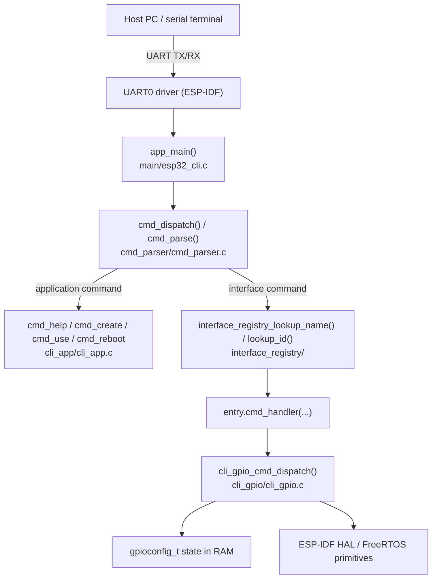
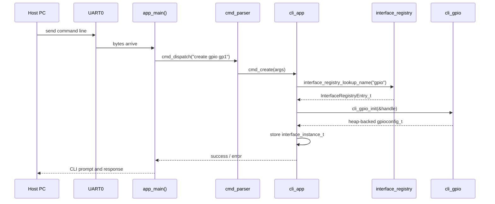
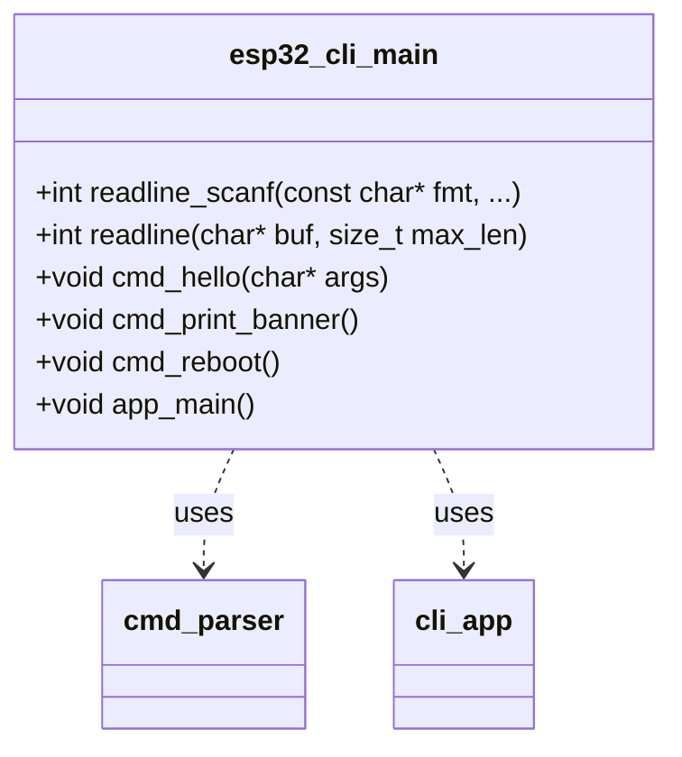
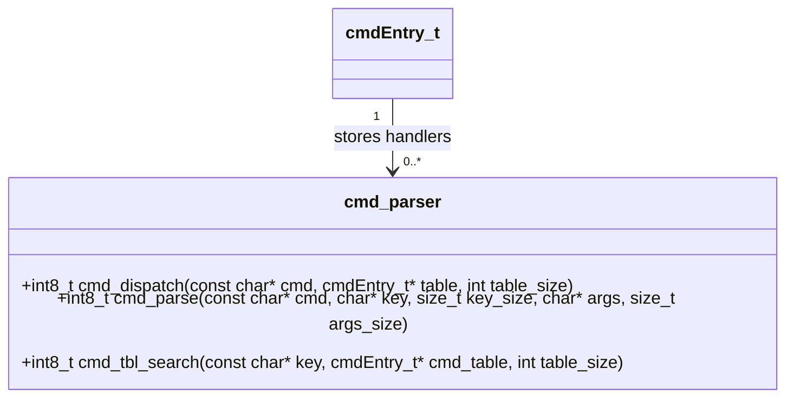
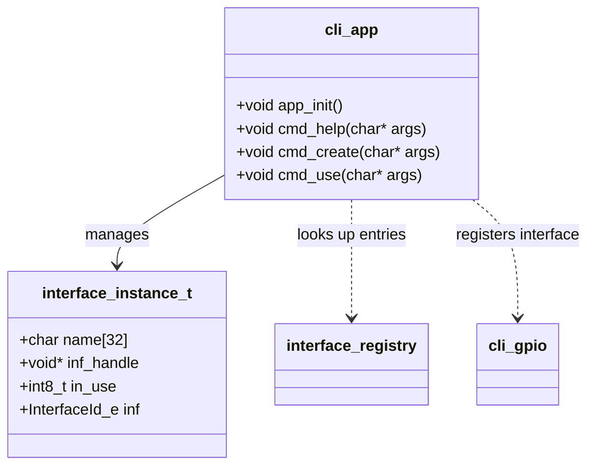
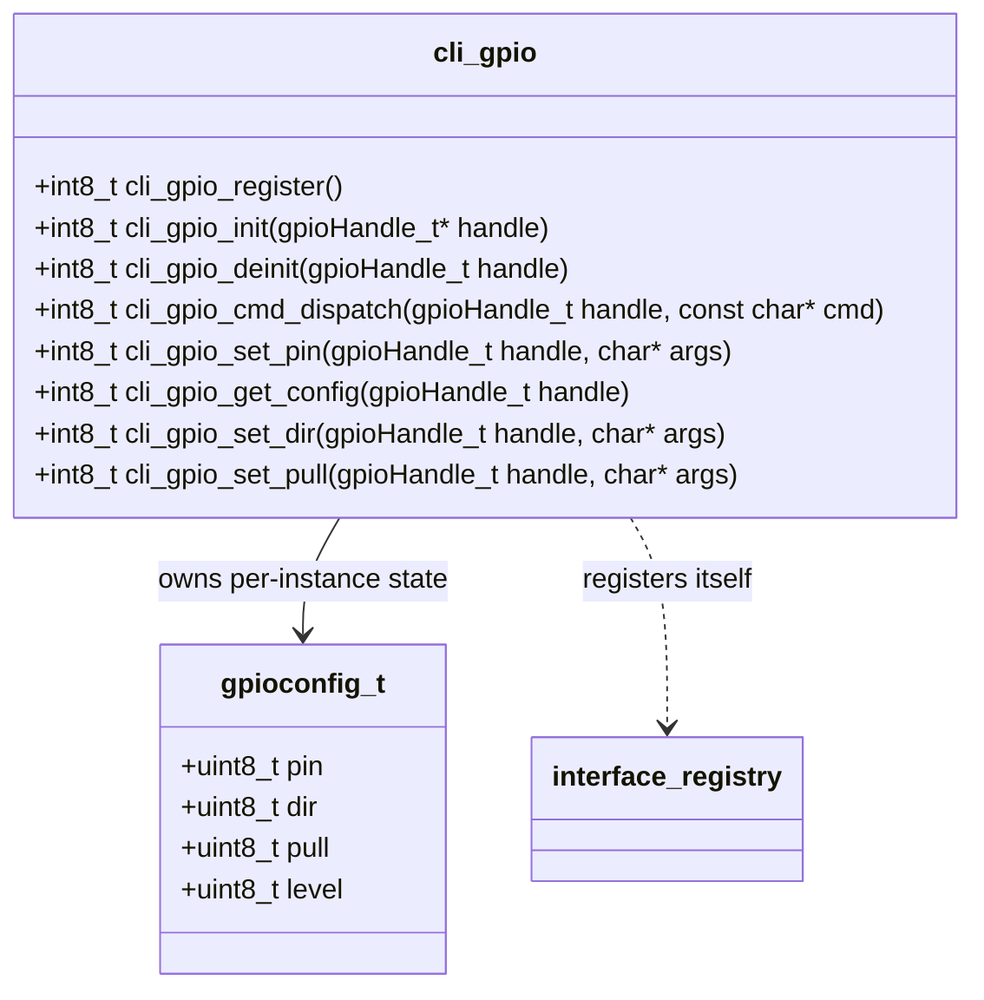
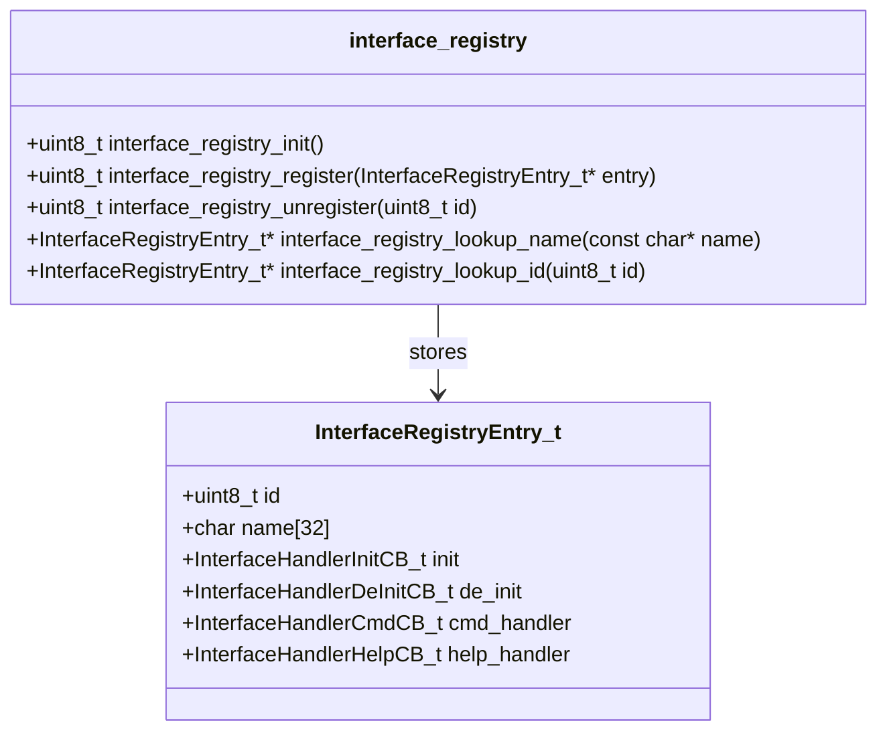
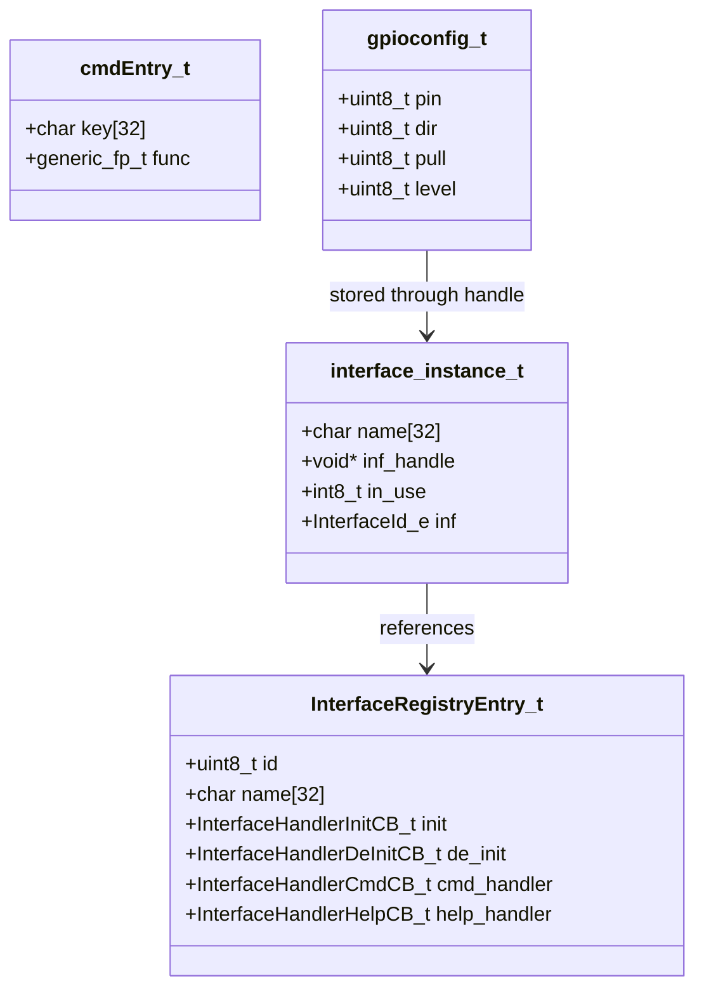
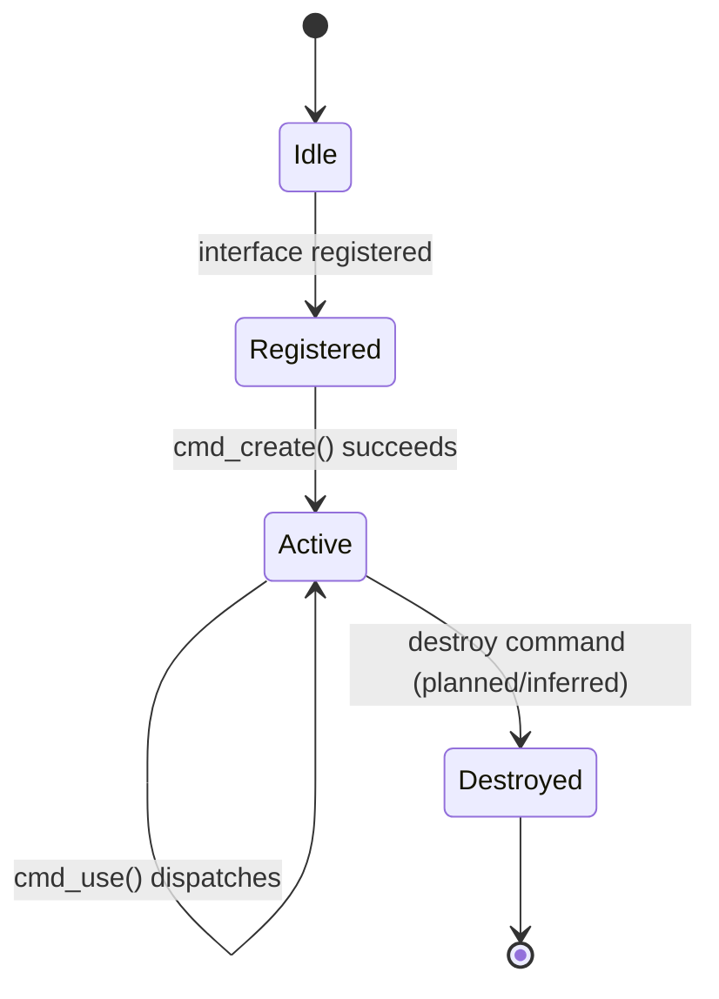

# ESP32 CLI Design Document

## Table of Contents

1. [Project Overview](#1-project-overview)
2. [System Architecture](#2-system-architecture)
3. [Module Breakdown](#3-module-breakdown)
4. [Key Design Decisions](#4-key-design-decisions)
5. [Data Structures & Interfaces](#5-data-structures--interfaces)
6. [Low-Level Details Worth Remembering](#6-low-level-details-worth-remembering)
7. [Open Threads](#7-open-threads)

---

## 1. Project Overview

This repository contains a small ESP32-S3 firmware project that exposes a UART-based command-line interface for creating and configuring simple hardware interface instances. The current implementation is intentionally lightweight: a host PC connects over UART, the firmware parses commands, and the CLI dispatches them to either application-level commands or interface-specific handlers. The first fully wired interface is GPIO, and the architecture is designed to scale toward additional interfaces such as I2C, SPI, and UART later.

The core problem it solves is a low-friction way to experiment with and control a subset of ESP32-S3 peripherals from a serial terminal without building a full host-side application. In practice the project is aimed at firmware developers and hardware tinkerers who want a compact, scriptable control layer for pin-level interaction.

### Current status

Working today:
- UART command loop is active in main/esp32_cli.c.
- Command parsing and dispatch are implemented in cmd_parser/cmd_parser.c.
- A registry-based interface model is implemented in interface_registry/interface_registry.c.
- GPIO interface registration, instance creation, and basic command dispatch are implemented in cli_gpio/cli_gpio.c.
- The app layer can create named interface instances and route `use` commands to the right interface handler.

In progress or incomplete:
- The project is still a single-threaded command loop; no RTOS task decomposition is present.
- The runtime model is static and fixed-size; there is no dynamic instance lifecycle beyond the current arrays and heap allocation per interface.
- A number of commands and capabilities mentioned in the earlier design notes are not implemented yet.

Stubbed or TODO-like areas:
- No real `destroy`, `destroy_all`, or `list` application commands are present in the current code.
- The GPIO implementation stores configuration in RAM and does not yet drive actual ESP32 peripheral registers through the HAL.
- The help text and command surface are incomplete and partly inconsistent with the actual implementation.

---

## 2. System Architecture

### High-level architecture



### Runtime command flow



### External dependencies and rationale

- ESP-IDF UART driver: chosen because the project targets the ESP32-S3 and the code already relies on the official peripheral driver API.
- FreeRTOS task delay primitives: used in the line-reading loop to yield while waiting for UART input.
- esp_system restart support: used by the `cmd_reboot` path.
- Standard C string and stdio support: used for parsing, logging, and console output.

Why these dependencies were chosen:
- The code is clearly written as an ESP-IDF component-based firmware project, so using the ESP-IDF HAL and FreeRTOS primitives is the default and lowest-friction path.
- The project does not appear to use a custom transport stack or external parser library; the implementation stays small and self-contained.

---

## 3. Module Breakdown

### 3.1 main/esp32_cli.c

Purpose: Entry point and top-level UART command loop.

Public interface:



Internal state it owns:
- The UART input buffer used by the loop.
- The command table `g_cmd_table` in the file.

Dependencies:
- cmd_parser for parsing/dispatch.
- cli_app for application-level commands.
- ESP-IDF UART and FreeRTOS headers.

Design patterns:
- Single-loop polling architecture; no separate task for input handling.
- Blocking line reader with periodic `vTaskDelay` while waiting for bytes.

### 3.2 cmd_parser/cmd_parser.c

Purpose: Tokenize a command line and locate a handler in a command table.

Public interface:



Internal state it owns:
- No dynamic state; it works on caller-provided buffers.

Dependencies:
- None beyond standard C string handling.

Design patterns:
- Simple table-driven dispatch.
- Minimal parser with no full shell grammar or quoting support.

### 3.3 cli_app/cli_app.c

Purpose: Own the application-level CLI commands and the runtime list of interface instances.

Public interface:



Internal state it owns:
- A global array of `interface_instance_t` objects, currently fixed at 10 entries.
- The current active interface mapping between name and instance handle.

Dependencies:
- interface_registry for lookup and registration.
- cli_gpio for initial registration.

Design patterns:
- Registry-driven instance lifecycle.
- Per-instance dispatch through a generic command callback.

### 3.4 cli_gpio/cli_gpio.c

Purpose: Implement the first concrete interface module for CLI-controlled GPIO-like configuration.

Public interface:



Internal state it owns:
- A heap-allocated `gpioconfig_t` instance for each created GPIO interface.

Dependencies:
- interface_registry to register the module.
- cmd_parser for command tokenization.

Design patterns:
- Per-interface command table plus callback dispatch.
- Opaque handle pattern: the app treats interface-specific state as `void*` and the module casts it back.

### 3.5 interface_registry/interface_registry.c

Purpose: Keep a single authoritative list of registered interface types.

Public interface:



Internal state it owns:
- A static array of `InterfaceRegistryEntry_t` entries, sized by `INTERFACE_REGISTRY_SIZE`.

Dependencies:
- None beyond standard string handling.

Design patterns:
- Centralized registry with duplicate detection and a single write path.

---

## 4. Key Design Decisions

### Decision: use a static registry and static instance table

The implementation uses fixed-size arrays rather than dynamic allocation for both the interface registry and the runtime instance pool. This is visible in interface_registry/interface_registry.c and cli_app/cli_app.c.

Likely alternatives considered:
- Dynamic allocation for every registered interface and instance.
- A linked list or heap-backed registry.

Trade-offs accepted:
- Simplicity and predictability win over flexibility.
- The design avoids heap fragmentation and makes the worst-case memory footprint obvious.
- The downside is that the maximum number of interfaces and instances is fixed at compile time.

### Decision: separate the app layer from interface implementations

The application module owns the orchestration and the instance table, while each interface module owns its own command table and per-instance state. The registry acts as the handshake point between them.

Likely alternatives considered:
- Putting all logic directly in the main loop.
- Hard-coding GPIO handling in cli_app.c.

Trade-offs accepted:
- New interfaces can be added by registering a new module and a new callback set.
- The architecture is clean for extension but still very lightweight and not fully formalized.

### Decision: keep the runtime single-threaded and poll-driven

The CLI reads from UART in a blocking loop with periodical delays. There is no RTOS task for command input and no interrupt-driven UART handler in the current design.

Likely alternatives considered:
- Separate input task plus queue.
- Interrupt-driven UART RX with a ring buffer.

Trade-offs accepted:
- Minimal complexity and fewer synchronization issues.
- The design is easy to understand but less responsive and less scalable under heavy or concurrent use.

### Notable TODOs and rough edges

- The help output in cli_app.c references modes like `gpio|i2c|spi|uart`, but the actual implementation only exposes the GPIO path and does not implement the other interfaces.
- The GPIO module does not touch actual ESP32 pin registers; it only manages a configuration structure.
- The current parser is intentionally simple and does not include robust quoting, escaping, or validation.
- The `cli_gpio_register()` function uses `strcpy` into a fixed-size buffer without additional bounds protection.
- There are no concrete destroy/list commands in the current app command table.

---

## 5. Data Structures & Interfaces

### Core data structures



### Why these structures are shaped this way

- `cmdEntry_t` is a compact table entry: a command name plus a function pointer. This makes dispatch simple and table-driven.
- `InterfaceRegistryEntry_t` is a registry record for interface type metadata, not instance state. That separation keeps the registration logic distinct from runtime instance management.
- `interface_instance_t` stores the runtime state for a created instance by name. It includes an opaque handle for interface-specific state and a type tag for dispatching.
- `gpioconfig_t` is a small, self-contained config block for the current GPIO interface implementation.

### Protocols and message formats

The protocol is currently just plain text over UART. Commands are single-line ASCII strings such as:
- `hello world`
- `create gpio gp1`
- `use gp1 set_pin IO_4`

The parser splits on the first space and treats the rest of the line as arguments. This means the grammar is intentionally minimal and there is no formal packet framing or binary protocol.

### Tunable parameters and ranges

- `INTERFACE_REGISTRY_SIZE`: fixed at 10 in interface_registry/include/interface_registry.h.
- `interface_instance_t.name[32]`: fixed size; longer names will be truncated by `strncpy` in the app layer.
- UART input buffers are 128 bytes in main/esp32_cli.c.
- The UART read loop uses a 50 ms read timeout and 10 ms delay while idle; these are effectively timing parameters for the command loop.

---

## 6. Low-Level Details Worth Remembering

### Blocking UART loop and timing behavior

The UART reader operates in a busy polling loop. It waits for bytes, then processes them line-by-line. There is no interrupt-driven receive path and no separate RX task.

```mermaid
sequenceDiagram
    participant Loop as readline()
    participant UART as UART0 driver
    participant Task as FreeRTOS scheduler

    Loop->>UART: uart_read_bytes(..., 50ms timeout)
    UART-->>Loop: 0 bytes or 1 byte
    alt no input
        Loop->>Task: vTaskDelay(10ms)
        Task-->>Loop: resume
    else input available
        Loop->>Loop: append / echo / handle backspace
    end
```

### Memory model and fragility

- Each GPIO instance currently allocates its own `gpioconfig_t` with `malloc()` in cli_gpio_init().
- No explicit ownership tracking is present beyond the app-side instance table.
- The runtime is effectively single-threaded, so shared state access is not yet protected by mutexes or semaphores.
- A future multi-task design would need to guard access to the global instance array and registry.

### Build and toolchain notes

- The project is an ESP-IDF component-based firmware project.
- The root CMakeLists.txt adds the local component directories and then invokes the ESP-IDF project machinery.
- Component wiring is visible in the CMakeLists files under main/, cli_app/, cli_gpio/, cmd_parser/, and interface_registry/.
- The build was not fully re-run in this environment because the local shell lacked an available CMake/IDF build toolchain path, so the document reflects the source layout and editor diagnostics rather than a fresh firmware build.

### Fragile spots that should not be changed casually

- The application relies on the global arrays and the registry entry tables being initialized in the expected order.
- The registry uses fixed-size strings, so a change to the field sizes or the entry layout will require auditing the `strcpy`/`strncpy` call sites.
- The interface module uses an opaque `void*` handle; changing the representation would require touching both the app layer and the interface module.

---

## 7. Open Threads

### Incomplete or missing features

- `destroy` and `destroy_all` are mentioned by the original design intent but not implemented in the current app command flow.
- `list` is not implemented, so there is no way to enumerate active instances from the CLI.
- The help system is incomplete and does not expose the actual runtime capabilities accurately.
- The GPIO module does not yet control hardware pins through ESP-IDF GPIO APIs; it only stores configuration state.

### Likely next steps, inferred from the current source

1. Add the missing application commands for instance teardown and listing.
2. Introduce a more explicit instance lifecycle state machine with a clear `created -> active -> destroyed` path.
3. Replace the simplified parser with stricter token handling and argument validation.
4. Add actual GPIO hardware control through the ESP-IDF GPIO driver and move the config state to a richer interface object.
5. If more interfaces are added, formalize the interface contract further and consider a more explicit per-interface capability table.

### Inferred state machine for interface instances


